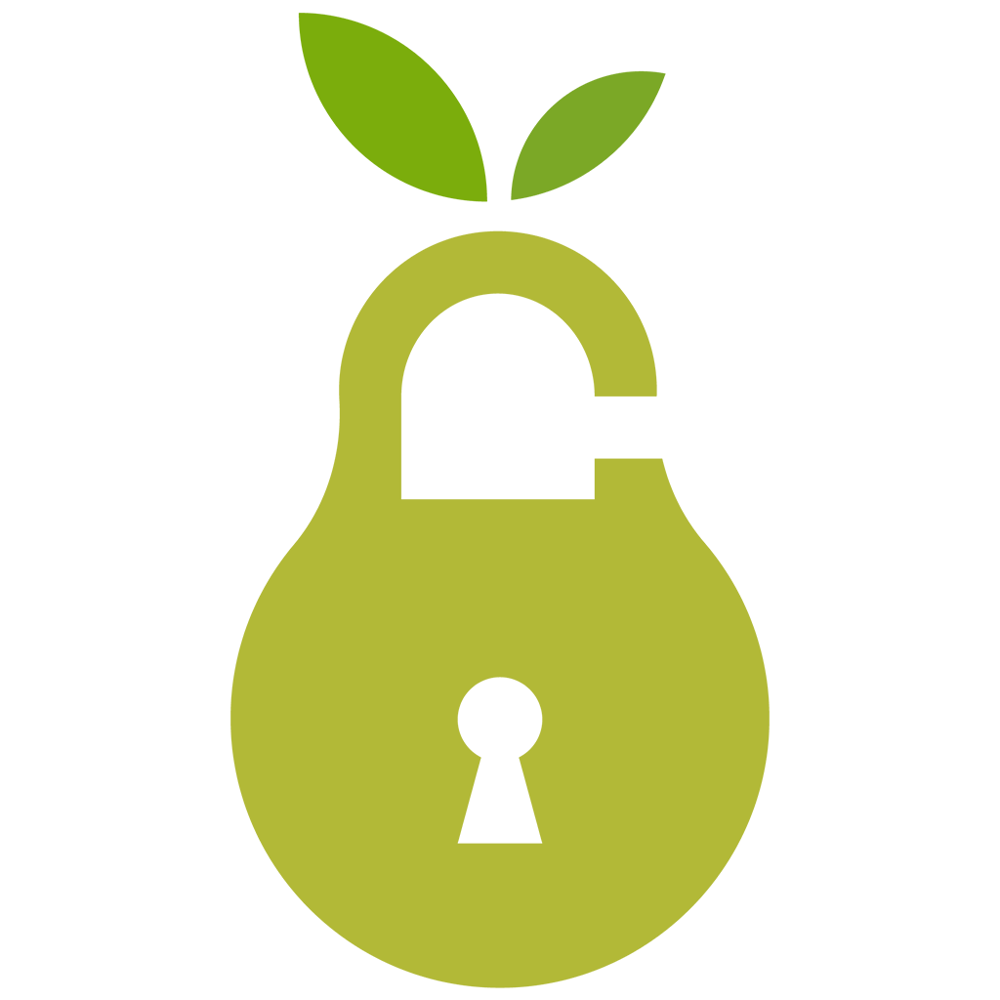

# golaaby

  

<h3 align="center">گلابی</h3>

---

 با گلابی به راحتی می تونید  تحریم های اینترنتی رو دور بزنید و بی دغدغه از سرویس هایی مثل شکن و گذر استفاده و DNS های سیستم خودتون رو مدیریت کنید.
      

## 📝 فهرست مطالب

- [golaaby](#golaaby)
  - [📝 فهرست مطالب](#%f0%9f%93%9d-%d9%81%d9%87%d8%b1%d8%b3%d8%aa-%d9%85%d8%b7%d8%a7%d9%84%d8%a8)
  - [🧐 درباره ](#%f0%9f%a7%90-%d8%af%d8%b1%d8%a8%d8%a7%d8%b1%d9%87)
  - [🏁 راهنمای استفاده ](#%f0%9f%8f%81-%d8%b1%d8%a7%d9%87%d9%86%d9%85%d8%a7%db%8c-%d8%a7%d8%b3%d8%aa%d9%81%d8%a7%d8%af%d9%87)
    - [نصب](#%d9%86%d8%b5%d8%a8)
    - [بخش اتصال خودکار](#%d8%a8%d8%ae%d8%b4-%d8%a7%d8%aa%d8%b5%d8%a7%d9%84-%d8%ae%d9%88%d8%af%da%a9%d8%a7%d8%b1)
    - [بخش اتصال دستی](#%d8%a8%d8%ae%d8%b4-%d8%a7%d8%aa%d8%b5%d8%a7%d9%84-%d8%af%d8%b3%d8%aa%db%8c)
    - [بخش تنظیمات](#%d8%a8%d8%ae%d8%b4-%d8%aa%d9%86%d8%b8%db%8c%d9%85%d8%a7%d8%aa)
  - [🧱 ساخت](#%f0%9f%a7%b1-%d8%b3%d8%a7%d8%ae%d8%aa)
  - [⛏️ کتابخونه ها و تکنولوژی های مورد استفاده ](#%e2%9b%8f%ef%b8%8f-%da%a9%d8%aa%d8%a7%d8%a8%d8%ae%d9%88%d9%86%d9%87-%d9%87%d8%a7-%d9%88-%d8%aa%da%a9%d9%86%d9%88%d9%84%d9%88%da%98%db%8c-%d9%87%d8%a7%db%8c-%d9%85%d9%88%d8%b1%d8%af-%d8%a7%d8%b3%d8%aa%d9%81%d8%a7%d8%af%d9%87)

## 🧐 درباره 

شاید برای شما هم پیش اومده که بخواین از یه سایت خاص استفاده کنید با بازی کنید ولی به دلیل تحریم ها امکانش فراهم نباشه 🙄 خب ساده ترین راه حل استفاده از پروکسی و vpn هست  که مشکلاتشون یکی دوتا نیست ، هم امنیت ندارن هم ping  شما رو بالا می برن و هم منع قانونی دارن (مثلا 🙃) اما شما می تونید خیلی راحت تر از اینا موقعیت خودتون رو مخفی کنید و از تحریم ها عبور کنید . اونم با استفاده از DNS Proxy ها.
خوشبختانه تو ایران سرویس دهنده هایی مثل شکن و گذر داریم که امکان استفاده از DNS proxy هارو برای ما فراهم کردن . واقعا دستشون درد نکنه 🥰
اما  DNS proxy چیه ؟ به طور کلی DNS proxy ها DNS server  هایی هستن که با تغییر در مسیر ارتباط شما با سروری که قصد ارتباط با اون رو دارید میتونن موقعیت مکانی شما رو مخفی نگه دارن . 
خب گلابی چی میگه این وسط ؟🤔 هر بار که بخواین DNS سیستم تون رو عوض کنید باید وارد تنظیمات شبکه خودتون بشین ادرس  DNS server رو هم باید از قبل پیدا کنید و به طور دستی وارد کنید و حالا اگه اون DNS server  کار نکنه یا از کار بیوفته یا ... دوباره باید وارد تنظیمات بشین و خلاصه حسابی حوصلتون سر می ره 😑
ولی گلابی خودش سریع ترین DNS server رو براتون پیدا می کنه وصل می شه 😊
البته هنوز بخش های خودکارش یکم کار داره 😅

## 🏁 راهنمای استفاده 
### نصب
برای نصب می تونید آخرین نسخه رو از این صفحه دریافت کنید.

### بخش اتصال خودکار 
تو این صفحه به راحتی می تونید با انتخاب گزینه ی اتصال به سریع ترین DNS server  متصل می شید . بعد از اتصال هم می تونید لینک سرویس دهنده رو تو این صفحه مشاهده کنید و با انتخاب قطع اتصال ، DNS server  شما به پیش فرض (ارائه دهنده ی اینترنت شما) تغییر می کنه.
### بخش اتصال دستی
این بخش سری امکانات در اختیارت شما قرار میده  که باهاشون می تونید DNS server  های سیستم خودتون رو مدیریت کنید. 
 - اگه می خوایین خودتون DNS server  اضافه کنید با انتخاب کلید افزودن به راحتی می تونید اون رو به لیست DNS server  ها اضافه کنید .
 - جدول داخل این صفحه هم لیست DNS server  های فعلی رو در اختیارتون  می زاره و یه سری گزینه برای مدیریتشون بهتون میده.
### بخش تنظیمات
تو این بخش می تونید به برنامه بگید با بالا اومدن ویندوز به طور خودکار اجرا بشه .
امکانات دیگه هم بعدا اضافه می شه. 😁

## 🧱 ساخت
- مطمئن بشین js node روی سیستم شما نصبه . (برای دانلود می تونید به این
لینک مراجعه کنید).
- پوشه پروژه رو تو CMD یا خط فرمان باز کنید و از دستور . i npm استفاده کنید تا وابستگی های
پروژه نصب بشن.
- بعد  با دستور make run npm پروژه شروع به ساخته شدن می کنه و پوشه ای به نام out در
پروژه ایجاد می شه . بعد از اتمام ساخت می تونید با مراجعه به x64-win32-golaaby در پوشه out بدون نصب
پروژه را اجرا کنید و یا به پوشه ی \make\ windows.squirrel\ x64\  برین و اون رو نصب کنید.

## ⛏️ کتابخونه ها و تکنولوژی های مورد استفاده 

- [NodeJs](https://nodejs.org/en/) 
- [Electron](https://electronjs.org/) - واسه همین یکم حجمش زیاد شد 😅
- [ReactJS](https://reactjs.org/)
- [Webpack](https://webpack.js.org/)
- [Babel](https://babeljs.io/)
- [Sass](https://sass-lang.com/)
- [Bootstrap](https://getbootstrap.com/)

